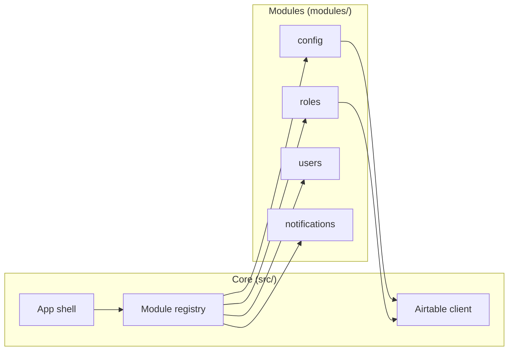

# Airtable Desktop

An **Electron + React** starter for building **Airtable-backed desktop applications**. Connect to a base, model tables in config, ship list screens with TanStack Query, and extend the product with **pluggable modules**—without forking the core shell every time you add a feature.

Built for teams who want a real desktop shell (OAuth, connection profiles, debug tooling, in-app documentation) and a clear path from prototype to packaged app.

---

## What you get

| Area | Description |
|------|-------------|
| **Shell** | Header, drawer navigation, command palette (⌘K / Ctrl+K), themes, error boundaries |
| **Airtable** | REST client with retries, PAT or OAuth (PKCE), connection profiles, table registry |
| **Developer tools** | Table lookup & codegen, screen scaffold, CSS tokens / MUI theme previews, debug panel |
| **Modules** | Optional features under `modules/<id>/` with manifests, Airtable provisioning, menus, header slots |
| **UI kit** | Shared list pages (`RecordListPage`, `DataTable`, `FormDrawer`, grid/card views) |

Core code lives in `src/`. Product features live in `modules/` and are enabled via `src/config/enabledModules.ts`.



---

## Prerequisites

- **Node.js** 20+
- **npm** 10+
- An [Airtable](https://airtable.com) account and a base to develop against
- For **OAuth**: an Airtable OAuth integration ([create one](https://airtable.com/create/oauth))
- For **module provisioning** (Developer → Modules → Enable): token scope `schema.bases:write` on your integration or PAT

---

## Quick start

```bash
git clone <your-repo-url>
cd airtable-desktop
npm install
cp .env.example .env   # optional — see Configuration
npm run electron:dev
```

1. Open the app (Electron window loads from Vite at `http://127.0.0.1:5173/`).
2. **Menu (☰)** → **Airtable connection** → enter **Base ID** (`app…` from the base URL) and a **personal access token**, or complete OAuth setup below.
3. **Save** and confirm the connection status shows **Connected**.

**In-app documentation:** use the native menu **Developer → Documentation** (or enable modules and explore **Developer → Modules**). Repo guides live under [`docs/`](docs/).

---

## Configuration

### Environment variables

Copy [`.env.example`](.env.example) to `.env`. Only `VITE_*` variables are exposed to the renderer.

| Variable | Required | Purpose |
|----------|----------|---------|
| `VITE_AIRTABLE_PAT` | No | Default personal access token ([create tokens](https://airtable.com/create/tokens)) |
| `VITE_AIRTABLE_BASE_ID` | No | Default base id (`app…`) |
| `VITE_AIRTABLE_OAUTH_CLIENT_ID` | For OAuth | Integration client id |
| `VITE_AIRTABLE_OAUTH_REDIRECT_URI` | For OAuth | Must match Airtable exactly (default `http://127.0.0.1:5173/`) |
| `VITE_AIRTABLE_OAUTH_SCOPES` | For OAuth | Space-separated scopes |
| `VITE_AIRTABLE_OAUTH_CLIENT_SECRET` | Rare | Confidential clients; used in Electron main process only — **never commit** |
| `VITE_ENABLE_DEBUG_PANEL` | No | Set `true` for internal QA production builds |
| `AIRTABLE_DEBUG` | No | Electron: enable DevTools + **View → Open Debug Panel** on production builds |

Saved credentials in the app (connection dialog or avatar menu) override empty env defaults. See [connection profiles](docs/connection-profiles.md).

### OAuth

Full walkthrough: **[docs/oauth-setup.md](docs/oauth-setup.md)**.

Short checklist:

1. Create an OAuth integration → copy **Client ID**.
2. Register redirect URL `http://127.0.0.1:5173/` (trailing slash must match `.env`).
3. Enable scopes: `data.records:read`, `data.records:write`, `schema.bases:read` (add `schema.bases:write` for module provisioning), `user.email:read` recommended.
4. Set `VITE_AIRTABLE_OAUTH_*` in `.env`.
5. Run `npm run electron:dev` → **Airtable connection** → **Sign in with OAuth** → base id → **Save**.

Token exchange runs in the **Electron main process** (no CORS issues in dev).

### Enabled modules

Edit [`src/config/enabledModules.ts`](src/config/enabledModules.ts):

```ts
export const enabledModuleIds = [
  'config',
  'roles',
  'users',
  'notifications',
] as const satisfies readonly string[]
```

Or use **Developer → Modules → Enable** while connected (Electron dev also updates this file). Restart dev after manual edits.

---

## Modules

Modules are self-contained plugins under `modules/<id>/`. Each exports a manifest from `index.ts`; core discovers them at build time and registers **tables**, **routes**, **drawer menu**, **Electron menu items**, and optional **header slots** only for enabled ids.

| Module | Purpose | Depends on |
|--------|---------|------------|
| [`config`](modules/config/) | Key–value App Config + `module.<id>.enabled` flags | — |
| [`roles`](modules/roles/) | Roles and role permissions | `config` |
| [`users`](modules/users/) | App users (OAuth identity or custom passwords) | `config`, `roles` |
| [`notifications`](modules/notifications/) | Pub/sub notifications, header bell, Airtable persistence | `config` |

**Enable order:** `config` → `roles` → `users` / `notifications`.

**Operator docs:** each module includes `airtable-setup.md`. **Developer guide:** [docs/modules.md](docs/modules.md) and **Documentation → Modules** in the app.

### Enable a module (recommended)

1. Connect to your base (PAT or OAuth with `schema.bases:write` for auto-provision).
2. **Developer → Modules** → select module → **Enable**.
3. App provisions dependency modules, creates tables from `blueprints.ts`, seeds config rows, saves table ids, reloads.

**Uninstall** disables the module and clears local provisioning state; it does **not** delete Airtable tables.

### Build a new module

1. **Copy a template** — `modules/config/` or `modules/roles/` → `modules/<your-id>/`.
2. **Manifest** — edit `index.ts`:

```ts
import type { AppModuleDefinition } from '../../src/lib/modules/types.ts'
import { myTableBlueprints } from './blueprints.ts'
import { myModuleTables } from './tables.ts'

const myModule = {
  id: 'inventory',
  name: 'Inventory',
  version: '0.1.0',
  dependsOn: ['config'] as const,
  description: 'Stock and locations.',
  readmePath: 'README.md',
  airtableSetupPath: 'airtable-setup.md',
  tables: myModuleTables,
  tableBlueprints: myTableBlueprints,
  screens: [
    {
      id: 'inventoryList',
      title: 'Inventory',
      importScreen: () => import('./screens/InventoryListScreen.tsx'),
    },
  ],
  menuItems: [
    {
      id: 'inventory-list',
      label: 'Inventory',
      icon: 'gridView',
      viewId: 'inventoryList',
      placements: [
        { surface: 'appDrawer', section: { id: 'inventory', label: 'Inventory' } },
        // Optional: native menu bar
        // { surface: 'electron', menu: 'developer', order: 40 },
      ],
    },
  ],
} satisfies AppModuleDefinition

export default myModule
```

3. **`tables.ts`** — stable `key`, field map (`camelCase` → Airtable columns), columns, validation. Use **Developer → Tables** to paste `tbl…` ids or snippets.
4. **`blueprints.ts`** — schema for **Enable** (Meta API).
5. **Data layer** — `hooks/` with `useAirtableListQuery` / `useAirtableMutation`, `lib/*FromRecords.ts` mappers.
6. **UI** — list screens using `src/components/ui/` only (`RecordListPage`, `RecordCollectionView`, `FormDrawer`). Reference: `modules/roles/screens/RolesListScreen.tsx`.
7. **Enable** — add `'inventory'` to `enabledModuleIds`, restart, **Developer → Modules → Enable**.

#### Menu placements

| Placement | Where it appears |
|-----------|------------------|
| `{ surface: 'appDrawer', section: { id, label } }` | Hamburger menu |
| `{ surface: 'electron', menu: 'view' \| 'developer', order? }` | Native menu bar (macOS/Windows/Linux) |

Legacy `menuSections` still works (drawer only). Built-in dev screens (Tables, Modules, Documentation, tokens) register in **Electron menus only** via `src/lib/menu/coreMenuContributions.ts`.

#### Header slots & notifications

```ts
headerSlots: [
  { id: 'bell', order: 10, importSlot: () => import('./components/MyHeaderSlot.tsx') },
]
```

Use `useHeaderSlotContext()` from `src/components/main/headerSlotContext.ts` for navigation.

Any module can emit notifications without depending on the notifications module:

```ts
import { publishNotification } from '../src/lib/notifications/index.ts'

publishNotification({
  title: 'Stock low',
  sourceModule: 'inventory',
  severity: 'warning',
  linkView: 'inventoryList',
})
```

Runtime feature flags (requires `config` module): `useModuleEnabled('inventory')` from `modules/config/hooks/useModuleEnabled.ts`.

**Full reference:** [docs/modules.md](docs/modules.md) · [modules/README.md](modules/README.md)

---

## Core screens vs modules

| Approach | Location | When to use |
|----------|----------|-------------|
| **Module** | `modules/<id>/` | Product features, enable/disable, Airtable provisioning |
| **Core screen** | `src/screens/` + `src/config/screens.ts` | Shell-only or experiments |

For core-only screens, use **Developer → Tables** codegen and **Documentation → Scaffold a screen**. Modules do **not** require edits to `src/config/screens.ts` or `menu.ts`.

---

## Development

### Scripts

| Command | Description |
|---------|-------------|
| `npm run electron:dev` | **Recommended** — Vite + Electron + hot reload |
| `npm run dev` | Vite in browser only (OAuth via Vite proxy) |
| `npm run build` | Production renderer + Electron main/preload |
| `npm run electron:start` | Run production build in Electron |
| `npm run typecheck` | TypeScript (app + electron + preload) |
| `npm run lint` | ESLint |
| `npm run lint:fix` | ESLint with auto-fix |
| `npm run test` | Vitest (watch) |
| `npm run test:run` | Vitest single run (CI) |
| `npm run pack` | Unpacked app in `release/` |
| `npm run dist` | Installers (all platforms configured) |
| `npm run dist:linux` / `dist:mac` / `dist:win` | Platform-specific installers |

Packaging notes: [docs/electron-builder-publish.md](docs/electron-builder-publish.md).

### Project layout

```
airtable-desktop/
├── electron/              # Main process, menu, OAuth token exchange
├── modules/               # Pluggable features (manifest + screens + hooks)
│   ├── config/
│   ├── roles/
│   ├── users/
│   └── notifications/
├── src/
│   ├── App.tsx            # Shell, providers, module bridges
│   ├── config/            # enabledModules.ts, table registry merge
│   ├── components/
│   │   ├── main/          # Header, menu, routing
│   │   └── ui/            # Shared UI kit (required for module screens)
│   ├── content/developerDocs/  # In-app documentation
│   ├── hooks/             # Core + generated data hooks
│   ├── lib/
│   │   ├── airtable/      # REST client, OAuth, mapping
│   │   ├── modules/       # Discovery, registry, provisioning
│   │   ├── menu/          # Menu placement aggregation
│   │   └── notifications/ # Pub/sub bus (core API)
│   └── screens/           # Core / developer screens
├── docs/                  # Repo guides
└── .env.example
```

### Quality checks

```bash
npm run typecheck
npm run lint
npm run test:run
```

### Debug

With debug enabled (`AIRTABLE_DEBUG=1` in dev, or `VITE_ENABLE_DEBUG_PANEL=true` + `AIRTABLE_DEBUG=1` for production QA):

- **View → Open Debug Panel** (⌘⇧D / Ctrl+Shift+D) — network, errors, performance
- **View → Toggle Developer Tools**

---

## Documentation

| Resource | Description |
|----------|-------------|
| **In-app** | Developer → Documentation |
| [docs/modules.md](docs/modules.md) | Module authoring |
| [docs/oauth-setup.md](docs/oauth-setup.md) | OAuth integration |
| [docs/connection-profiles.md](docs/connection-profiles.md) | Dev / Prod profiles |
| [docs/airtable-query.md](docs/airtable-query.md) | TanStack Query patterns |
| [docs/pagination.md](docs/pagination.md) | Large lists |
| [docs/scaffold-screen.md](docs/scaffold-screen.md) | Core screen scaffold |
| [docs/starter-feature-ideas.md](docs/starter-feature-ideas.md) | Extension ideas |

---

## Publishing to GitHub

Before pushing:

1. Remove or rotate any secrets in `.env` (never commit `.env`).
2. Set `repository.url` in `package.json` to your GitHub repo.
3. Update `author`, `homepage`, and `productName` in `package.json` / `electron-builder.yml` if you are forking for your own product.
4. Run `npm run typecheck && npm run lint && npm run test:run`.
5. Add a LICENSE file if you change from MIT.

---

## License

MIT — see [package.json](package.json).
