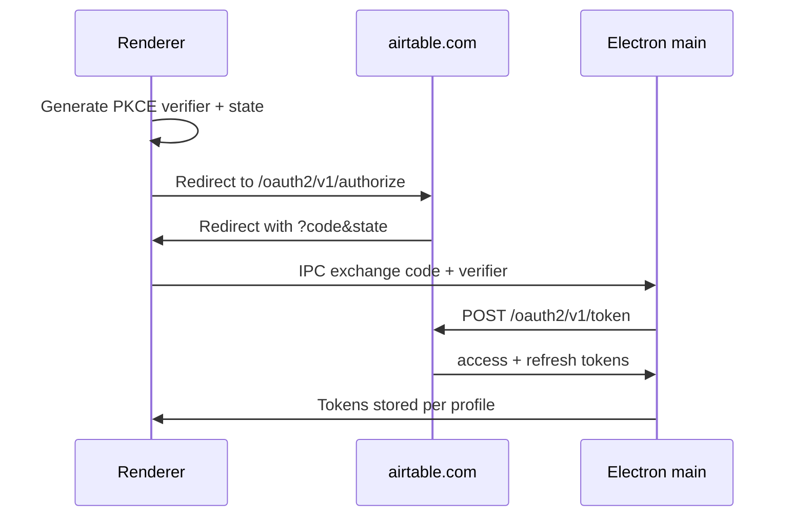

# OAuth setup guide

This app supports **OAuth 2.0 with PKCE** (recommended for user sign-in) or a **personal access token (PAT)**. OAuth tokens are stored per [connection profile](connection-profiles.md) in local storage.

Official reference: [Airtable OAuth](https://airtable.com/developers/web/api/oauth-reference)

---

## Overview

| Approach | Best for |
|----------|----------|
| **OAuth** | End users sign in; refresh tokens; no long-lived PAT in the UI |
| **PAT** | Solo dev, scripts, or when OAuth is not configured |

OAuth requires configuration in **two places**:

1. **Airtable** — create an OAuth integration (client id, redirect URLs, scopes).
2. **This app** — `.env` variables read by Vite + optional client secret for confidential clients.

---

## Part 1 — Configure Airtable

### 1. Create an OAuth integration

1. Open [Create OAuth integration](https://airtable.com/create/oauth) (or your workspace **Builder hub → Integrations**).
2. Create a new integration for your desktop app.
3. Note the **Client ID** (you will paste it into `.env` as `VITE_AIRTABLE_OAUTH_CLIENT_ID`).

### 2. Redirect URLs (must match exactly)

Airtable compares the `redirect_uri` in the authorize request **character-for-character** with a URL you register.

| How you run the app | Register this redirect URL |
|---------------------|----------------------------|
| **`npm run electron:dev`** (recommended) | `http://127.0.0.1:5173/` |
| **`npm run dev`** (browser only) | `http://127.0.0.1:5173/` or `http://localhost:5173/` — must match `VITE_AIRTABLE_OAUTH_REDIRECT_URI` |

Tips:

- Include the **trailing slash** if your `.env` uses one (`http://127.0.0.1:5173/`).
- Do not mix `localhost` and `127.0.0.1` unless both are registered. The connection dialog shows the **exact** redirect URL to paste into Airtable.
- If you see **“failed to properly construct a request”** on Airtable’s page, the redirect URL or scopes in [create/oauth](https://airtable.com/create/oauth) do not match `.env` (this is almost always redirect URI or scopes not enabled on the integration).
- For **packaged/production** builds, add the URL users land on after authorize (often a custom protocol or `file://` is not valid — use an `https://` or `http://127.0.0.1:PORT/` URL your app can load).

### 3. Scopes

Enable scopes on the integration that match what you put in `VITE_AIRTABLE_OAUTH_SCOPES` (space-separated in `.env`).

**Minimum for this starter:**

| Scope | Why |
|-------|-----|
| `data.records:read` | List and read records |
| `data.records:write` | Create / update / delete (CRUD hooks) |
| `schema.bases:read` | **Developer → Tables** (Meta API base schema) |

**Recommended:**

| Scope | Why |
|-------|-----|
| `user.email:read` | Avatar / whoami display name |

Example scopes string:

```text
data.records:read data.records:write schema.bases:read user.email:read
```

Add scopes in Airtable **before** using them in `.env`. A mismatch causes `invalid_scope` errors.

### 4. Public vs confidential client

| Type | Client secret | This app |
|------|---------------|----------|
| **Public** (PKCE) | None | Default — PKCE verifier sent on token exchange; `client_id` in POST body |
| **Confidential** | Required | Set `VITE_AIRTABLE_OAUTH_CLIENT_SECRET` in `.env` (never commit); Electron main process sends `Authorization: Basic` on token exchange |

This starter uses **PKCE (S256)** for public clients, which is the usual choice for desktop apps.

---

## Part 2 — Configure the app

### 1. Copy environment file

```bash
cp .env.example .env
```

### 2. Set OAuth variables

```env
# From Airtable integration settings
VITE_AIRTABLE_OAUTH_CLIENT_ID=your_client_id_here

# Must match a registered redirect URL exactly
VITE_AIRTABLE_OAUTH_REDIRECT_URI=http://127.0.0.1:5173/

# Space-separated — must be enabled on the integration
VITE_AIRTABLE_OAUTH_SCOPES=data.records:read data.records:write schema.bases:read user.email:read

# Optional: default base (app… from base URL); can also set in the connection dialog
VITE_AIRTABLE_BASE_ID=

# Confidential clients only — keep out of git
# VITE_AIRTABLE_OAUTH_CLIENT_SECRET=your_client_secret
```

| Variable | Required | Description |
|----------|----------|-------------|
| `VITE_AIRTABLE_OAUTH_CLIENT_ID` | Yes (for OAuth) | Integration client id |
| `VITE_AIRTABLE_OAUTH_REDIRECT_URI` | Yes (for OAuth) | Registered redirect URL |
| `VITE_AIRTABLE_OAUTH_SCOPES` | Yes (for OAuth) | Space-separated scope list |
| `VITE_AIRTABLE_OAUTH_CLIENT_SECRET` | Confidential only | Token exchange auth (Electron main) |
| `VITE_AIRTABLE_OAUTH_TOKEN_URL` | No | Override; browser dev uses Vite proxy by default |

Restart the dev server after changing `.env`.

### 3. Run with Electron (recommended)

```bash
npm run electron:dev
```

Token exchange runs in the **Electron main process** (`electron/main.ts` → `https://airtable.com/oauth2/v1/token`), avoiding browser CORS.

### 4. Browser-only dev (optional)

```bash
npm run dev
```

The renderer uses **Vite dev proxies** because the browser cannot call Airtable directly without CORS issues:

- `/__airtable_oauth/v1/token` → OAuth token exchange
- `/__airtable_api/v0/…` → REST API (records, meta, whoami)

Prefer Electron for OAuth during development.

---

## Part 3 — Sign in from the app

1. Start the app (`npm run electron:dev`).
2. Open the menu (**☰**) → **Airtable connection** (or avatar → **Manage connection**).
3. Enter your **Base ID** (`appXXXXXXXX` from the base URL: `https://airtable.com/appXXXXXXXX/...`).
4. Click **Sign in with OAuth**.
5. Complete sign-in in the browser window; you are redirected back to the dev URL with `?code=…&state=…`.
6. The app exchanges the code for tokens (PKCE), stores them on the **active connection profile**, and strips query params from the URL.
7. Click **Save** if you changed base id or profile settings.

You should see **Connected (OAuth)** in the dialog and your email in the avatar menu when `user.email:read` is granted.

To disconnect OAuth on the current profile: **Sign out OAuth** in the connection dialog.

---

## How it works (technical)



- **Authorize:** `https://airtable.com/oauth2/v1/authorize` with `code_challenge` (S256).
- **Token:** authorization code + `code_verifier` exchanged for access/refresh tokens.
- **Storage:** `localStorage` on the active connection profile; refresh before expiry when using the API.
- **PAT override:** If a profile has a saved PAT, it takes precedence over OAuth for API calls.

---

## Troubleshooting

| Symptom | Fix |
|---------|-----|
| `OAuth is not configured` | Set `VITE_AIRTABLE_OAUTH_CLIENT_ID` and `VITE_AIRTABLE_OAUTH_REDIRECT_URI` in `.env`; restart dev server |
| `OAuth scopes missing` | Set `VITE_AIRTABLE_OAUTH_SCOPES` (non-empty, space-separated) |
| `redirect_uri_mismatch` | Redirect URL in Airtable must **exactly** match `VITE_AIRTABLE_OAUTH_REDIRECT_URI` (scheme, host, port, path, trailing slash) |
| `invalid_scope` | Add scope in Airtable integration settings and in `.env`; spelling must match Airtable scope ids |
| CORS / token errors in browser | Use `npm run electron:dev` instead of `npm run dev` |
| OAuth works once, then `state` error | Do not refresh the callback URL; start login again from **Sign in with OAuth** |
| Confidential client fails | Set `VITE_AIRTABLE_OAUTH_CLIENT_SECRET` in `.env` |
| API 401 after sign-in | Confirm base id; re-sign-in; check scopes include `data.records:read` |

Use the **debug panel** (bug icon) → **Network** to inspect authorize redirect and token requests (when debug mode is enabled).

---

## Related docs

- [README.md](../README.md) — quick OAuth summary
- [connection-profiles.md](connection-profiles.md) — Dev / Prod profiles and OAuth per profile
- In-app: **Developer → Documentation → OAuth setup**
